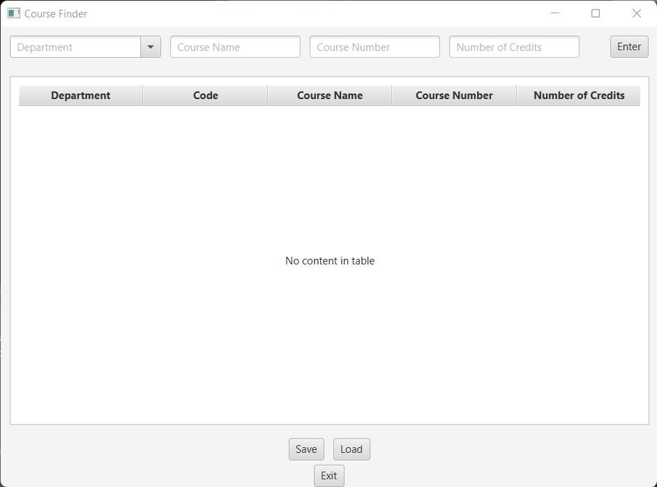

<h1 align="center"> Welcome to cs2263_hw03 👋</h1>

# 🏫 Courses Application
Small UI application using JavaFx that stores information about courses offered in six departments for CS2263 at Idaho State University.

# 🚀 Usage
<P> To run this application it is important that you have git bash, git, and gradle installed. </P>
<p> Open the file location in git bash. </p>

```
cd /fileDirectory/cs2263_hw03
```

<p> Next all you have to do it run it. </p>

```
gradle run 
```

<p> Then a new window should pop up with the application as shown below:</p>




<p> Then simply enter all the information needed and press enter. The data will show up in the table and can be saved.</p>

# Author
✨ **Savannah Webb**  
* Github: [WEBBsava](https://github.com/WEBBsava)

# 🤝 Credits
* [How to Write a Good README File for Your GitHub Project](https://www.freecodecamp.org/news/how-to-write-a-good-readme-file/) to help make this README file better
* [keep a changelog](https://keepachangelog.com/en/1.0.0/) to help write the CHANGELOG

# 🗎 License
Copyright 2022 [Savannah Webb](https://github.com/WEBBsava) <br> This project is [MIT](app/LICENSE) licensed.
